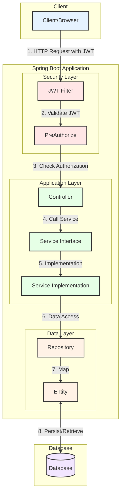

# Spring Boot REST API Starter

A modern, production-ready Spring Boot starter template for building secure REST APIs with comprehensive authentication, authorization, and auto-generation capabilities.

## 🌟 Overview

This starter template provides a robust foundation for Java-based REST API development using Spring Boot and Gradle. It includes enterprise-level features such as JWT authentication, appRole-based access control, comprehensive API documentation, and automated code generation tools.


## 📋 Table of Contents

- [Features](#-features)
- [Tech Stack](#-tech-stack)
- [Compatible Frontend Applications](#-compatible-frontend-applications)
- [System Architecture](#-system-architecture)
- [Getting Started](#-getting-started)
- [Configuration](#-configuration)
- [Database Setup](#-database-setup)
- [API Documentation](#-api-documentation)
- [Authentication & Authorization](#-authentication--authorization)
- [Auto Code Generation](#-auto-code-generation)
- [Docker Support](#-docker-support)
- [Production Deployment](#-production-deployment)

## ✨ Features

### Core Features
- **Spring Boot** - Latest supported version with production-ready configurations
- **RESTful API Architecture** - Clean, scalable API design patterns
- **Spring Data JPA** - Hibernate-based ORM with repository pattern
- **Multi-Database Support** - H2 (development), MySQL, PostgreSQL
- **Input Validation** - Comprehensive validation using Jakarta Bean Validation
- **Global Exception Handling** - Centralized error handling and response formatting

### Security Features
- **JWT Authentication** - Stateless authentication with refresh token support
- **Role-Based Access Control (RBAC)** - Fine-grained permission system
- **Method-Level Security** - Annotation-based endpoint protection
- **Access Control Lists (ACL)** - Flexible permission management

### Development Features
- **Auto Code Generation** - Automatic CRUD operations and frontend code generation
- **OpenAPI 3 Documentation** - Interactive Swagger UI documentation
- **Environment-Based Configuration** - Separate configs for development/production
- **Internationalization (i18n)** - Multi-language support
- **Comprehensive Logging** - Log4j2 integration with configurable levels

### DevOps Features
- **Docker Ready** - Complete containerization support
- **Gradle Build System** - Modern build tool with dependency management
- **Health Checks** - Spring Boot Actuator endpoints
- **Profile-Based Deployment** - Environment-specific configurations

## 🛠 Tech Stack

| Category | Technology |
|----------|------------|
| **Framework** | Spring Boot 3.x |
| **Build Tool** | Gradle 8.x |
| **Language** | Java 17+ |
| **Database** | H2, MySQL 8+, PostgreSQL |
| **ORM** | Hibernate (Spring Data JPA) |
| **Security** | Spring Security + JWT |
| **Documentation** | OpenAPI 3 (Swagger) |
| **Testing** | JUnit 5, Mockito |
| **Containerization** | Docker |

## 🎨 Compatible Frontend Applications

This API is designed to work seamlessly with modern frontend frameworks:

- **[Nuxt.js + Quasar](https://github.com/bekaku/nuxt-quasar-example-app)** - Server-side rendered Vue.js application
- **[Vue.js 3 + Quasar 2+](https://github.com/bekaku/vue-quasar-example-app)** - Modern Vue.js SPA & SSR
- **[Vue.js 3 + Ionic 8](https://github.com/bekaku/vue-ionic-example-app)** - Mobile-first application

## 🏗 System Architecture



## 🚀 Getting Started

### Prerequisites

- **Java 17+** - Required for Spring Boot 3.x
- **MySQL 8+** or **PostgreSQL** (optional, H2 included for development)
- **Git** - For cloning the repository

### Installation

1. **Clone the repository**
   ```bash
   git clone https://github.com/bekaku/java-spring-boot-starter.git
   cd java-spring-boot-starter
   ```

2. **Run the application**
   ```bash
   ./gradlew bootRun
   ```

3. **Verify installation**
   Open your browser and navigate to: `http://localhost:8080/welcome`

### Project Structure

```
src/
├── main/
│   ├── java/com/bekaku/api/spring/
│   │   ├── annotation/          # Custom annotations
│   │   ├── configuration/       # Spring configurations
│   │   ├── controller/          # REST controllers
│   │   ├── dto/                 # Data Transfer Objects
│   │   ├── exception/           # Exception handling
│   │   ├── mapper/              # Entity-DTO mappers
│   │   ├── mybatis/             # MyBatis
│   │   ├── model/               # JPA entities
│   │   ├── repository/          # Data repositories
│   │   ├── service/             # Business logic interfaces
│   │   ├── serviceImpl/         # Business logic implementations
│   │   ├── util/                # Utility classes
│   │   ├── validator/           # Custom validators
│   │   └── vo/                  # Value Objects
│   └── resources/
│       ├── files/               # Static files
│       ├── i18n/                # Internationalization
│       ├── mybatis/              # MyBatis mappers (if used)
│       ├── static/              # Web static resources
│       ├── application.yml      # Main configuration
│       └── application-dev.yml  # Development configuration
└── test/
    └── java/                    # Test classes
```

## ✨ Configuration

### Environment Configuration

The application supports multiple environments through Spring profiles:

**Main Configuration** (`application.yml`)
```yaml
server:
  port: 8080

spring:
  profiles:
    active: dev  # Change to 'prod' for production
app:
   url: https://api.your-domain.com
   port: 443
   cdn-directory: /usr/spring-data/
   cors:
      allowed-origins:
         - https://your-production-webapp.com #  Frontend dev server
```

**Development Configuration** (`application-dev.yml`)
```yaml
app:
  url: http://127.0.0.1
  port: 8080
  cdn-directory: /path/to/your/spring-data/
  front-end:
    theme: NUXT_QUASAR  # Options: NUXT_QUASAR, QUASAR
  cors:
     allowed-origins:
        - http://localhost:3004 # Ionic dev (Development Web)
        - http://localhost:3003 # Frontend dev server
```

### Database Configuration

Configure your database connection in `application.yml` or `application-dev.yml`:

```yaml
spring:
  datasource:
    url: jdbc:mysql://localhost:3306/your_db_name?allowPublicKeyRetrieval=true&useSSL=false
    username: your_username
    password: your_password
    driver-class-name: com.mysql.cj.jdbc.Driver
  
  jpa:
    hibernate:
      ddl-auto: validate
    show-sql: false
    properties:
      hibernate:
        format_sql: true
```

Configure your log4j in `log4j2-prod.xml` or `log4j2-dev.xml`:
```
<Property name="APP_LOG_ROOT">/path/to/your/spring-data/logs</Property>
```

## ✨ Database Setup

### Database Installation

1. **Import the database schema**
   ```bash
   # Windows
   mysql -uroot -p your_db_name < E:\path\to\spring_starter.sql
   
   # Linux/macOS
   mysql -uroot -p your_db_name < /path/to/spring_starter.sql
   ```

2. **Update configuration**
   Update the database connection details in your configuration files.

### Supported Databases

- **H2** - In-memory database for development and testing
- **MySQL 8+** - Production-ready relational database
- **PostgreSQL** - Advanced open-source database

## 📚 API Documentation

### Swagger UI

Access interactive API documentation at:
- **Swagger UI**: `http://localhost:8080/swagger-ui/index.html`
- **OpenAPI JSON**: `http://localhost:8080/api-docs`

### Key API Endpoints

| Endpoint | Method | Description | Auth Required |
|----------|--------|-------------|---------------|
| `/api/auth/login` | POST | User authentication | No |
| `/api/appUser/currentUserData` | GET | Get current appUser info | Yes |
| `/api/permission` | GET, POST, PUT, DELETE | Permission management | Yes |
| `/api/appRole` | GET, POST, PUT, DELETE | Role management | Yes |
| `/api/appUser` | POST | User registration | Yes |

## 🔐 Authentication & Authorization

### Authentication Flow

1. **Login Request**
   ```json
   POST /api/auth/login
   {
     "appUser": {
       "emailOrUsername": "admin@mydomain.com",
       "password": "P@ssw0rd",
       "loginForm": 1
     }
   }
   ```

2. **Success Response**
   ```json
   {
     "userId": 1,
     "authenticationToken": "eyJhbGciOiJIUzUxMiJ9...",
     "refreshToken": "eyJhbGciOiJIUzUxMiJ9...",
     "expiresAt": "2024-10-29T01:24:46.019+00:00"
   }
   ```

### Authorization Headers

For protected endpoints, include the JWT token in the Authorization header:

```
Authorization: Bearer YOUR_JWT_TOKEN
Content-Type: application/json
Accept-Language: en
Accept-ApiClient: default
```

### Method-Level Security

Use the `@PreAuthorize` annotation to protect specific endpoints:

```java
@PreAuthorize("isHasPermission('role_list')")
@GetMapping
public ResponseEntity<Object> findAll(Pageable pageable) {
    // Implementation
}

@PreAuthorize("isHasPermission('role_add||user_manage')")
@PostMapping
public ResponseEntity<Object> create(@Valid @RequestBody RoleDto dto) {
    // Implementation
}
```

## 🔧 Auto Code Generation

### Enable Auto Generation

1. **Annotate your entity**
   ```java
   @GenSourceableTable(createFrontend = true)
   @Entity
   public class YourEntity extends BaseEntity {
       // Entity fields
   }
   ```

2. **Generate source code**
   ```bash
   POST http://localhost:8080/dev/development/generateSrc
   ```

### Generated Files

The system automatically generates:
- **DTO classes** - Data Transfer Objects
- **Repository interfaces** - Data access layer
- **Service interfaces** - Business logic contracts
- **Service implementations** - Business logic
- **REST controllers** - API endpoints
- **Frontend components** - Vue.js forms and lists (optional)

## 🐳 Docker Support

### Build and Run with Docker

1. **Build the application**
   ```bash
   ./gradlew bootJar
   ```

2. **Build Docker image**
   ```bash
   docker-compose build
   ```

3. **Run with Docker Compose**
   ```bash
   docker-compose up -d
   ```

### Docker Configuration

The included `docker-compose.yml` provides:
- Application container
- Database container (MySQL/PostgreSQL)
- Volume mapping for persistent data
- Network configuration

## 🚀 Production Deployment

### Build Production JAR

```bash
./gradlew bootJar
```

The JAR file will be available in `/build/libs/`

### Production Configuration

1. **Set production profile**
   ```yaml
   spring:
     profiles:
       active: prod
   ```

2. **Configure logging**
   Update `log4j2-prod.xml` with appropriate log levels and file paths.

3. **Environment variables**
   ```bash
   export MYSQL_HOST=your-db-host
   export MYSQL_USERNAME=your-username
   export MYSQL_PASSWORD=your-password
   ```

### Health Checks

Monitor application health using Spring Boot Actuator endpoints:
- `/actuator/health` - Application health status
- `/actuator/info` - Application information
- `/actuator/metrics` - Application metrics


## 📞 Support

For questions and support:

- **Issues**: [GitHub Issues](https://github.com/bekaku/java-spring-boot-starter/issues)
- **Documentation**: This README and inline code comments
- **Examples**: Check the frontend application repositories linked above

## 📄 License

This project is licensed under the MIT License - see the [LICENSE](LICENSE) file for details.

---

**Happy Coding! 🎉**
